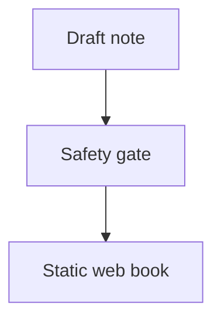

# Markdown Compatibility Long Title For Mobile Layout Stress Testing In A Static Web Book

This note checks [[Voice Service System Design]], [[Privacy Design For Voice Assistant Notes|privacy note]], and [[Robustness Design#Failure Modes]] links.
It also includes an unresolved example: [[Missing Review Note]].

## Heading Anchor Target

Readers should be able to link directly to this section.

## Callouts

> [!WARNING] Review reminder
> Keep examples synthetic.
> Avoid private service names, private URLs, and internal identifiers.

> [!TIP]
> Use short paragraphs when publishing notes for mobile reading.

## Table

| Area | Check |
|---|---|
| Links | Wikilinks resolve or show a missing marker |
| Tables | Horizontal scroll protects narrow screens |
| Code | Fenced blocks preserve language classes |

## Mermaid



## Code

```js
const status = "public-safe";
console.log(status);
```

Inline code such as `publish: true` should remain readable.

## Lists

- first item
  - nested item
  - nested item with [[Voice Service System Design#Goals]]
- second item

## Missing Image

![[missing-image.png]]

## Korean Sample

이 문서는 공개 가능한 예시 문장만 포함합니다. 모바일 화면에서도 제목, 표, 코드 블록이 읽기 쉬워야 합니다.
